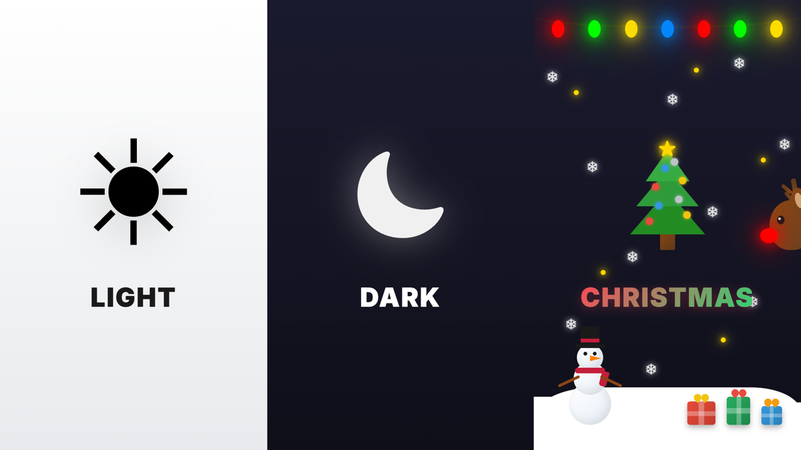

<div align="center">

# Christmas Mode

### Dark mode is boring. Use Christmas mode.



[](https://www.npmjs.com/package/christmas-mode)
[](https://packagephobia.com/result?p=christmas-mode)
[](https://x.com/codyapearce)
[](https://bsky.app/profile/codyapearce.bsky.social)

Add festive Christmas decorations to any website with a single line of code.

</div>

## Installation

```bash
npm install christmas-mode
```

Or include via CDN:

```html
<script src="https://unpkg.com/christmas-mode/dist/christmas-mode.umd.js"></script>
```

## Quick Start

### ES Modules

```javascript
import ChristmasMode from "christmas-mode";

ChristmasMode.init();
ChristmasMode.enable();
```

### CommonJS

```javascript
const ChristmasMode = require("christmas-mode");

ChristmasMode.init();
ChristmasMode.enable();
```

### Browser (UMD)

```html
<script src="https://unpkg.com/christmas-mode/dist/christmas-mode.umd.js"></script>
<script>
  ChristmasMode.init();
  ChristmasMode.enable();
</script>
```

### Auto-Enable

```javascript
ChristmasMode.init({ autoEnable: true });
```

### React

```jsx
import { useEffect } from "react";
import ChristmasMode from "christmas-mode";

function App() {
  useEffect(() => {
    ChristmasMode.init({ autoEnable: true });

    return () => {
      ChristmasMode.destroy();
    };
  }, []);

  return <div>My App</div>;
}
```

## Features


- Falling snow with accumulation effect
- Twinkling Christmas lights along the top
- Icicles hanging from the lights
- Decorated Christmas tree with ornaments and star
- Snowman with hat and scarf
- North Pole sign with candy canes
- Caroler that plays Jingle Bells (click to toggle music)
- Santa's sleigh with 9 reindeer (including Rudolph!)
- Marching nutcracker soldiers
- Walking elves carrying presents
- Sledding elves
- Elves having a snowball fight
- Stockings hung along the bottom
- Presents under the tree
- Holly decorations
- Festive wreath with bow
- Toggle switch to enable/disable

## API

### `ChristmasMode.init(options?)`

Initialize Christmas Mode with optional configuration.

```javascript
ChristmasMode.init({
  toggle: true, // Show toggle switch (default: true)
  musicButton: true, // Show music button/caroler (default: true)
  autoEnable: false, // Auto-enable on init (default: false)
  snow: true, // Enable snow effect (default: true)
  lights: true, // Enable Christmas lights (default: true)
  tree: true, // Enable Christmas tree (default: true)
  snowman: true, // Enable snowman (default: true)
  northPole: true, // Enable North Pole sign (default: true)
  target: document.body, // Target element (default: document.body)
});
```

### Toggle Position

```javascript
ChristmasMode.init({
  toggle: {
    position: "bottom-right", // 'bottom-right' | 'bottom-left' | 'top-right' | 'top-left'
  },
});
```

### `ChristmasMode.enable()`

Enable Christmas Mode (show decorations).

### `ChristmasMode.disable()`

Disable Christmas Mode (hide decorations).

### `ChristmasMode.toggle()`

Toggle Christmas Mode on/off.

### `ChristmasMode.isEnabled()`

Returns `true` if Christmas Mode is currently active.

### `ChristmasMode.playMusic()`

Start playing Jingle Bells.

> **Note:** Due to browser autoplay policies, music can only start after user interaction (e.g., clicking the caroler or a button). It cannot autoplay on page load.

### `ChristmasMode.stopMusic()`

Stop the music.

### `ChristmasMode.toggleMusic()`

Toggle music on/off.

### `ChristmasMode.destroy()`

Completely remove Christmas Mode and clean up all elements.

## Contained Mode

You can target a specific element instead of the entire page:

```javascript
ChristmasMode.init({
  target: document.getElementById("my-container"),
  autoEnable: true,
});
```

## TypeScript

TypeScript definitions are included:

```typescript
import ChristmasMode, { ChristmasModeOptions } from "christmas-mode";

const options: ChristmasModeOptions = {
  autoEnable: true,
  snow: true,
  tree: true,
};

ChristmasMode.init(options);
```

## Browser Support

Works in all modern browsers (Chrome, Firefox, Safari, Edge).

## License

MIT
